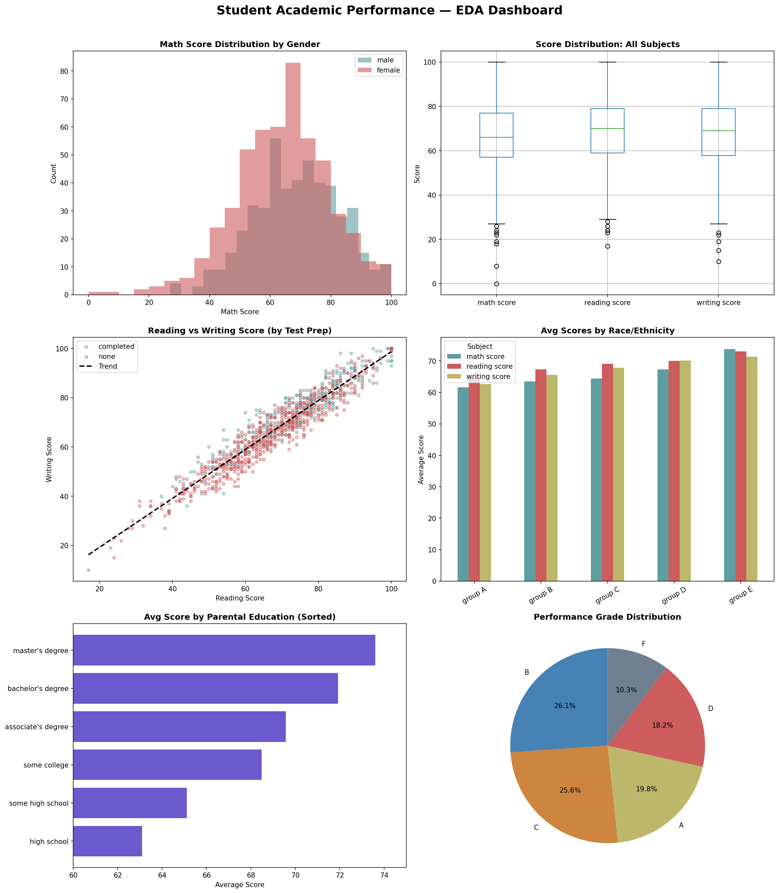

# AI/ML Internship — Week 1
## Student Academic Performance EDA

Name: Adina Zafar
Week: 1 of 8  
Dataset: Students Performance in Exams (1,000 rows, 8 columns)

## Project Overview
Analyzed a dataset of 1,000 students and their exam scores in math,
reading, and writing as part of Week 1 of the AI/ML Internship Program
by Digitech Offerings. The analysis covers data cleaning, statistical
summaries, group comparisons, feature engineering, and a full EDA
dashboard built with Matplotlib and Seaborn.

## Key Findings
1. Test preparation course completers scored **15.4% higher in writing**
  and showed improvement across all three subjects
2. Math was the weakest subject overall — lowest average **(66.09)**,
  highest spread (std = 15.16), and lowest pass rate **(39.1%)**
3. Reading and writing scores are strongly correlated **(r = 0.955)**,
  suggesting integrated literacy teaching could be more effective

## Tools & Libraries
- Python 3
- NumPy 2.0.2
- Pandas 2.2.2
- Matplotlib 3.10.0
- Seaborn 0.13.2
- Google Colab

## Best Visualization

